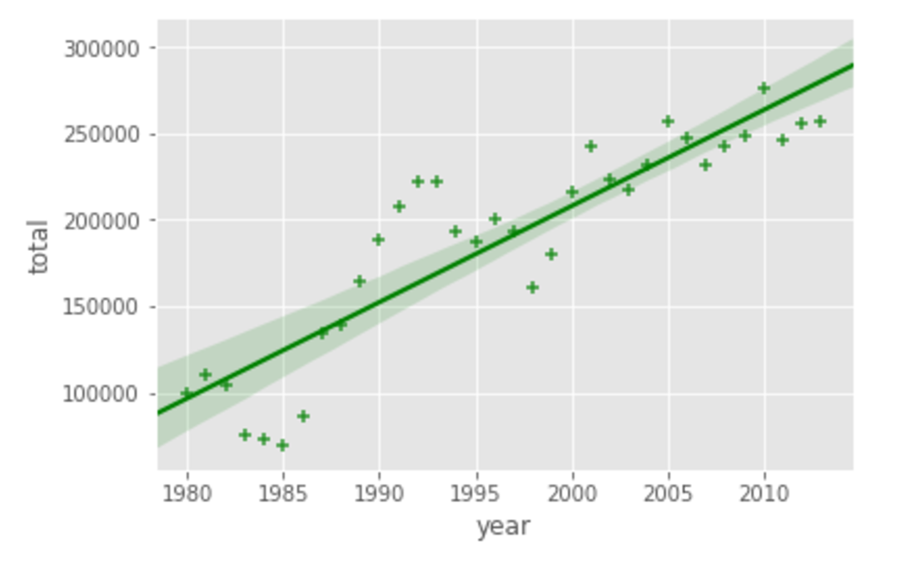

# week3
## [Advances Visualization tools](https://www.coursera.org/learn/python-for-data-visualization/exam/nJc7I/advanced-visualization-tools/attempt)
### 1. Seaborn is a Python visualization library that provides a high-level interface for drawing attractive statistical graphics, such as regression plots and box plots. 
=> `True.`
### 2. The following code:  
```python
import seaborn as sns
ax = sns.regplot(x="year", y="total", data=data_df, color="green")
```  
- produce the following chart:


